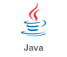
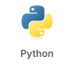
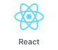
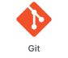

<h1 align="center">Hi 👋, I'm Hanjae Kim (DarkLight0418)</h1>
<h3 align="center">안녕하세요~ 반갑습니다!!!</h3>

- 📫 How to reach me **samseong0418@naver.com**

<h3 align="left">✨ 소개 (introduction) </h3>

  Backend / Full-stack을 공부하고 있는 개발자입니다.
  현재 대학생으로 프로젝트와 CS 기초를 함께 공부하고 있습니다.

---
<h3 align="left">🤝 같이 소통해요! (Connect with Me)</h3>

  
  
  

---

<h3 align="left">🛠 주로 공부하는 언어 및 툴들 (Languages and Tools)</h3>

<h4>💻 Languages</h4>

  
  

<h4>⚙️ Frameworks & Libraries</h4>

  
  

<h4>🗄️ Databases</h4>

  
  

<h4>🔧 Tools</h4>

  

